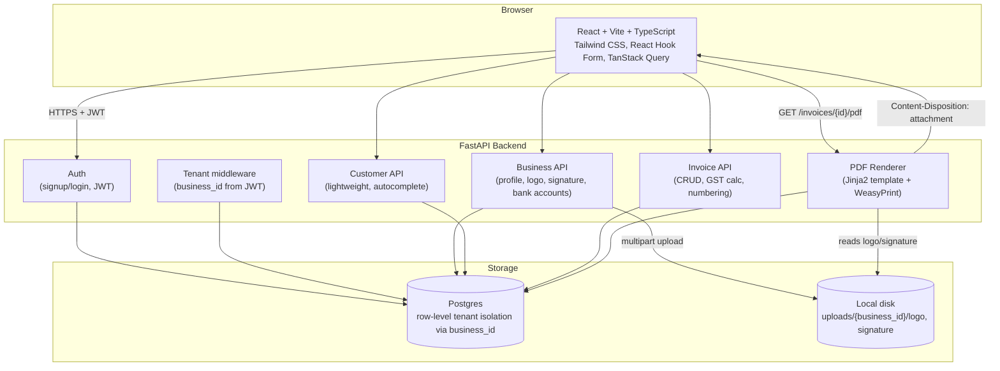

# Billing Buddy CRM — Invoicing v1 Design

Date: 2026-08-16
Status: Approved

## Purpose

Billing Buddy CRM's first slice is India-GST-compliant digital invoice generation for a
multi-tenant SaaS. Each business (tenant) signs up, sets up its profile (including logo and
signature), and creates/downloads GST sale invoices matching the reference layout (see
`Pasted image.png` in repo root — a Dattani Steel / GoGSTBill-style sale invoice form).

Customer/vendor CRM, product/inventory management, purchase invoices, payments ledger, expense
tracking, and reporting are deferred to later phases — this spec covers invoicing only.

## Architecture

All API requests (except signup/login) pass through the tenant middleware, which resolves
`business_id` from the JWT and scopes every query to that business. No cross-tenant reads are
possible without going through this layer.

## Data model

- **Business** (tenant): `name`, `gstin`, `address`, `state`, `state_code`, `phone`, `email`,
  `logo_url`, `signature_url`, `invoice_prefix`, `invoice_postfix`, `next_invoice_seq`
- **User**: `email`, `password_hash`, `business_id`, `role`
- **BankAccount**: `business_id`, `bank_name`, `account_no`, `ifsc`, `is_default`
- **Customer**: `business_id`, `name` (M/S), `address`, `contact_person`, `phone`, `gstin_pan`,
  `place_of_supply` (state), `reverse_charge`, `ship_to` — created inline from the invoice form,
  reused via autocomplete on repeat customers
- **Invoice**: `business_id`, `customer_id`, `invoice_type`, `invoice_no`, `invoice_date`,
  `challan_no`/`challan_date`, `po_no`/`po_date`, `lr_no`, `eway_no`, `delivery_mode`, `due_date`,
  `bank_account_id`, `discount_type` (Rs/%), `discount_value`, `tcs`, `round_off`, `terms_title`,
  `terms_detail`, `notes`, `remarks`, `taxable_total`, `tax_total`, `grand_total`, `payment_type`
  (credit/cash/cheque/online — recorded only, no gateway), `status` (draft/saved)
- **InvoiceLineItem**: `invoice_id`, `sr_no`, `product_name` (free text, no inventory link yet),
  `hsn_sac`, `qty`, `uom`, `price`, `discount`, `gst_rate`, `line_total`

## GST calculation

Each line item has a GST rate (0/5/12/18/28). The backend compares `Business.state` to
`Customer.place_of_supply`: same state → CGST+SGST (rate split in half each); different state →
IGST (full rate). Invoice totals roll up taxable value, tax, TCS, discount, and round-off into a
grand total, plus an amount-in-words string (INR number-to-words).

## Invoice numbering

`Business.invoice_prefix` / `invoice_postfix` / `next_invoice_seq` drive auto-numbering. Creating
an invoice claims the next sequence number; prefix/postfix default from the business setting but
are editable per-invoice.

## File uploads (logo, signature)

Multipart upload endpoints store files under `uploads/{business_id}/` on local disk; the DB
stores only the path. Served back via a FastAPI static route. Local disk is sufficient for v1
single-server deployment; swapping to S3-compatible storage later only touches the storage
adapter, not the API contract.

## PDF generation and download

Server-side rendering: a Jinja2 HTML template (styled to match the reference screenshot) is
rendered with invoice + business (logo, signature) + customer data, then converted to PDF via
WeasyPrint. `GET /invoices/{id}/pdf` returns the PDF with `Content-Disposition: attachment` so
it downloads directly in the browser.

The template is swappable: when the user-provided PDF template is available, it replaces the
initial template file without changing the rendering pipeline or data contract.

## API surface (FastAPI)

- `POST /auth/signup`, `POST /auth/login` → JWT
- `GET/PUT /business` (profile)
- `POST /business/logo`, `POST /business/signature` (multipart upload)
- `GET/POST/PUT/DELETE /bank-accounts`
- `GET/POST/PUT/DELETE /customers`
- `GET/POST/PUT/DELETE /invoices`
- `GET /invoices/{id}/pdf` (download)

## Testing

- **Backend**: pytest — unit tests for GST split logic, invoice numbering, amount-in-words;
  API tests for auth + invoice CRUD against a test DB (isolated per test, tenant-scoping
  verified: a business must never see another business's data).
- **Frontend**: skip automated tests for v1; verify the invoice form manually against the
  reference screenshot.

## Out of scope for v1

Customer/vendor management UI, products/inventory, purchase invoice, payment ledger,
expense/income, reports, AI invoice generation, real payment gateway integration, invoice
emailing, multi-currency. These match the other tabs in the reference screenshot (Dashboard,
Products/Services, Purchase Invoice, Payment, Expense/Income, Other Documents, Report) — all
deferred to later phases.
