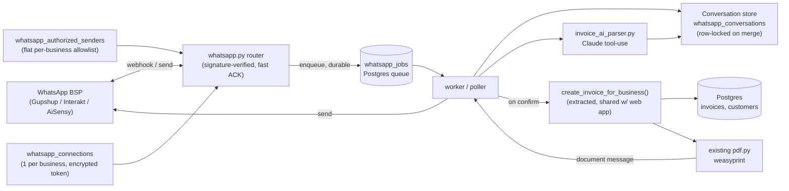

# WhatsApp Invoice Drafting — Design Spec

**Status:** Revised three times (adversarial review, blocking-item review,
should-fix review) — ready for implementation planning
**Date:** 2026-08-17
**Scope:** Owner-only command flow, v1

## Auth model (v1 reality)

The app has **no per-user RBAC**. Auth is business-level: the JWT carries
`business_id`, and every authenticated request acts as the business
(`backend/app/deps.py` — `get_current_business` returns a `Business`, not a
`User`). `User.role` was removed in migration 0003. There is no
"invoice-create permission" and no "manage integrations" permission to
gate against.

Therefore, in v1: **`whatsapp_authorized_senders` is a flat per-business
allowlist of phone numbers.** Any authenticated session for that business
can add or remove a number. There is no `user_id` linkage and no live
permission re-check — being on the allowlist *is* the authorization to
create invoices by text, exactly as holding the business login is the
authorization to create them on the web. Enroll/remove actions are written
to `whatsapp_message_log`'s audit trail (or the app's general audit trail)
for traceability. Per-user permission granularity is deferred to whenever
RBAC is reintroduced.

## Summary

Business owners connect their WhatsApp number to the CRM and create invoices by
texting free-form details ("Invoice ABC Corp, 10 Widget @500, 18% GST") to it.
Claude parses the message into an invoice draft, asks targeted follow-up
questions for anything missing or ambiguous, and requires an explicit confirm
(WhatsApp buttons) before writing anything to the database. On confirm, the
flow calls the same invoice-creation logic the web app uses, then sends the
generated PDF back into the WhatsApp thread.

The WhatsApp channel drafts **invoices only**. The customer must already
exist in the CRM (added via the web app); an unknown customer name stops
the flow with a "set them up on the web first" reply. No customer, business,
or other master data is ever created or edited over WhatsApp in v1.

## Recommendation

Connect through a hosted, India-focused WhatsApp BSP (Gupshup, Interakt, or
AiSensy) rather than registering this CRM as a Meta Tech Provider directly.
Non-technical owners still connect in minutes through the BSP's hosted
onboarding; the BSP carries Meta Business verification, WABA policy
compliance, and per-number rate-limit ramp-up. This keeps the CRM focused on
invoicing rather than taking on permanent messaging-platform operational
risk (a policy violation on any connected number can affect the whole Tech
Provider app). Wrap the BSP behind a thin `whatsapp_client` adapter interface
(`send_text`, `send_buttons`, `send_document`, `verify_signature`) so a future
migration to direct Meta Cloud API — if volume or margins ever justify owning
that relationship — doesn't touch business logic.

**Open:** which specific BSP (Gupshup / Interakt / AiSensy) — needs a quick
comparison on India pricing, template-approval turnaround, and API ergonomics
before the adapter is built against one of them.

### Approaches considered

| Approach | Verdict |
|---|---|
| **C — Hybrid extract + slot-fill** (recommended) | Claude extracts everything it can from one message; only missing/ambiguous fields trigger a follow-up question. Natural for one-line dictation, falls back to structured questions when incomplete. |
| A — Single-shot parse only | Message must contain a complete invoice or is rejected. Simple, but forces one long structured message. |
| B — Fully scripted flow | Bot always asks a fixed sequence, no AI extraction. Predictable, but slow and defeats "just text it in." |

## Prerequisite refactor

`POST /invoices` (`backend/app/routers/invoices.py:110-131`) is a route
handler with FastAPI-injected `db`/`business`, not a standalone function.
Before building the WhatsApp flow, extract:

```python
def create_invoice_for_business(db: Session, business: Business, body: InvoiceCreate) -> Invoice:
    ...
```

so both the HTTP route and the WhatsApp worker call the same function. Small,
low-risk, independently testable — ship as its own PR first.

The function stays **customer-agnostic**: `body.customer_id` must reference
an existing customer owned by the business, and it raises 404 otherwise —
identical to today's web behavior. The WhatsApp path never creates a
customer (see below); it resolves the extracted name to an existing
`customers` row or stops.

### Prerequisite: secrets encryption helper

The repo encrypts nothing at rest today — there is no Fernet/KMS/master-key
mechanism. Before storing a BSP token, add a minimal symmetric-encryption
helper as its own PR:

```python
# app/security_crypto.py
def encrypt_secret(plaintext: str) -> str: ...   # cryptography.Fernet
def decrypt_secret(token: str) -> str: ...
```

- Key: `SECRET_ENCRYPTION_KEY` env var (urlsafe base64 32-byte Fernet key),
  delivered the same way as the existing JWT secret and DB URL in
  `app/config.py`. App fails fast at startup if it is missing or malformed.
- `whatsapp_connections.access_token_encrypted` stores `encrypt_secret(token)`;
  the value is decrypted only in-memory when building an outbound BSP request,
  never logged.
- Reusable for any future secret-at-rest need. Add `cryptography` to
  `pyproject.toml` deps (pin explicitly, matching the repo's pinning
  discipline).
- Key rotation is out of scope for v1 (single active key); note it as a
  follow-up.

### Prerequisite: move shared state to Postgres

The webhook + worker topology in this spec runs as **multiple processes**
(at minimum: the FastAPI app and a separate worker; either may be scaled
out). Two existing subsystems keep their state in process-local in-memory
dicts and are explicitly documented as single-instance-only:

- `app/rate_limit.py` — login failed-attempt counters
- `app/token_revocation.py` — logged-out JWT `jti` list

Both are wrong the moment a second process exists: a worker can't see the
app's revocation list, and per-sender WhatsApp rate limits tracked
in-memory would be `limit × process_count`. Ship a prerequisite PR that
moves both to Postgres:

| Table | Replaces | Key fields |
|---|---|---|
| `revoked_tokens` | `token_revocation.py` dict | `jti` (pk), `expires_at`. Insert on logout; `is_token_revoked` becomes an indexed lookup; a periodic sweep (or `WHERE expires_at > now()` filter) drops rows past expiry. |
| `rate_limit_events` | `rate_limit.py` dict | `bucket_key` (e.g. `email:x`, `ip:x`, `wa:business:sender`), `occurred_at`. A limit check counts rows in the window; a sweep trims old rows. Same sliding-window policy, now shared. |

`get_current_business`, `POST /auth/login`, and `POST /auth/logout` switch
to the table-backed calls with no behavior change for the single-instance
case. This unblocks a shared, correct WhatsApp rate limit (below) and makes
"RBAC re-checked live" / "revocation re-checked live" honest across the
worker process. Keep the same test-only `reset_all_state()` seam
(TRUNCATE the tables).

## Architecture

The webhook does the minimum needed to ACK fast and durably: verify sender
authenticity, check sender authorization, enqueue a job, return 200. A worker
does everything slow — parsing, conversation merge, invoice creation, PDF
generation, send-back — so a crash or deploy mid-request can never silently
drop a draft.

The worker runs as its own process (`python -m app.workers.whatsapp_worker`),
separate from the FastAPI app. The repo has no production deployment today
(dev is bare `uvicorn --reload`), so this work also lands a minimal one —
see "Deployment" below — that supervises and auto-restarts both the web and
worker processes. It can be scaled to multiple instances; job claiming uses
`SELECT ... FOR UPDATE SKIP LOCKED` against `whatsapp_jobs` so two workers
can never pick up the same job. This isn't optional hardening —
without it, autoscaling or a rollout overlap double-processes a job, which
compounds directly into duplicate invoice creation (see confirm idempotency
below).



## Deployment (minimal, delivered with this work)

There is no production deployment in the repo today. This work adds a
`docker-compose.yml` at the repo root with three services:

| Service | Command | Notes |
|---|---|---|
| `db` | postgres:16 | named volume; the only stateful service |
| `web` | `uvicorn app.main:app --host 0.0.0.0` (no `--reload`) | `restart: unless-stopped` |
| `worker` | `python -m app.workers.whatsapp_worker` | `restart: unless-stopped`; same image + env as `web`; runs the job poller **and** the retention sweep |

`restart: unless-stopped` is the supervisor — a crashed worker or web
process is restarted by the container runtime, which is what "a crash mid-job
is retried, not lost" depends on. Both processes share one image and one
`.env` (DB URL, JWT secret, `SECRET_ENCRYPTION_KEY`, BSP creds,
`ANTHROPIC_API_KEY`, `DEADLETTER_WEBHOOK_URL`).

**Dead-letter alerting.** When a `whatsapp_jobs` row exhausts its retries
and moves to `status = 'dead_letter'`, the worker:

1. logs it at `ERROR` with the job id, type, business id, and last error;
2. if `DEADLETTER_WEBHOOK_URL` is set, POSTs a one-line summary to it (a
   Slack/Discord incoming webhook, or anything that accepts a JSON body) —
   best-effort, failure to post is itself only logged, never retried into
   the same failure loop.

That is the whole v1 alerting surface — no metrics stack, no pager. A
`GET /whatsapp/admin/dead-letters` authenticated endpoint (business-scoped)
lists the business's own dead-lettered jobs so support can inspect payload
and error without DB access.

Single-instance is the default (`web` ×1, `worker` ×1); the `SKIP LOCKED`
job claim and Postgres-backed shared state (rate limit, revocation) mean
scaling either to ×N is a compose change, not a code change.

## Data model

No changes to `Invoice`, `InvoiceLineItem`, or `Customer` — the flow produces
the same `InvoiceCreate` payload the web form does. **The WhatsApp path is
write-only against invoicing tables** (`invoices`, `invoice_line_items`) plus
its own five tables below. It never inserts or updates a `Customer`, a
`Business`, a `BankAccount`, or a `User` — customer onboarding and all master
data stay web-app-only. An unrecognized customer name is a dead end with a
"add them on the web app first" reply, not a create prompt.

Five new tables:

| Table | Purpose | Key fields |
|---|---|---|
| `whatsapp_connections` | One connected WhatsApp number per business. Every webhook lookup filters on `status = 'active'` — never resolves a business from a disconnected/revoked connection, in case a BSP ever recycles a `phone_number_id` to a different tenant. | `business_id` (unique), `phone_number_id`, `waba_id`, `access_token_encrypted`, `status` |
| `whatsapp_authorized_senders` | Flat per-business allowlist of phone numbers permitted to issue commands. Being listed *is* the authorization (see Auth model). Enroll/remove is done from an authenticated business session and audit-logged. No `user_id` linkage in v1 — there are no per-user roles to link to. | `business_id`, `phone_e164` (unique per business), `enrolled_at`, `enrolled_by` (business session id / email, for audit) |
| `whatsapp_conversations` | In-progress draft state per sender. `draft_payload` is transient working state (may contain customer name, amounts, and GSTIN/PAN if the owner typed them), so the row is **hard-deleted 24h after it expires or is confirmed** by the sweep (see below) — it is not a record of anything, the created invoice is. Every read-modify-write — slot-fill merges, and the confirm→create transition — takes `SELECT ... FOR UPDATE` on that row, same mechanism as job claiming below, so two in-flight updates (second device, double-tap) serialize instead of racing. | `business_id`, `sender_phone_e164`, `state`, `draft_payload` (jsonb), `invoice_id` (nullable), `expires_at`, `updated_at` |
| `whatsapp_message_log` | Inbound `wa_message_id` dedup + a thin activity trail. Stores **only** the message id, direction, linked conversation, and timestamps — **no message body and no parsed content**, so it is not a PII store and needs no special retention. Dispute resolution ("what did the AI read") relies on the owner's own WhatsApp thread plus the confirm message and the resulting invoice, not on server-stored transcripts. | `wa_message_id` (unique), `direction`, `conversation_id`, `created_at` |
| `whatsapp_jobs` | Durable queue between the webhook (fast ACK) and the worker (slow work). `type` includes `inbound_message` and `outbound_send` — the PDF/confirmation send-back is its own retryable job, decoupled from invoice creation, so a WhatsApp delivery failure after the invoice is already committed doesn't strand the owner with no notification. Claimed via `SELECT ... FOR UPDATE SKIP LOCKED`. | `type`, `payload` (jsonb), `status` (`pending`\|`processing`\|`done`\|`dead_letter`), `attempts`, `last_error`, `claimed_at` (stale-claim reclaim), `created_at`, `processed_at` |

### Retention sweep

The worker runs a periodic maintenance pass (every few minutes, in the same
loop that polls `whatsapp_jobs`) that:

- hard-deletes `whatsapp_conversations` rows where
  `expires_at < now() - interval '24 hours'` **or** `state = 'confirmed'
  and updated_at < now() - interval '24 hours'`;
- deletes orphaned `whatsapp_message_log` rows once their conversation is
  gone (or keeps them capped at N days — they carry no PII either way);
- trims `revoked_tokens` past `expires_at` and `rate_limit_events` past
  their window (folded in from the shared-state prerequisite).

A single conversation is unusable for drafting 30 minutes after the last
message (state check); the 24h delay before the row is physically removed
is only so a confused owner who taps a stale "Confirm" gets a clean "this
draft expired, start again" rather than a row-not-found. No customer PII
lingers past 24h + the draft window.

## Message flow

```mermaid
sequenceDiagram
    participant Owner as Owner (WhatsApp)
    participant WA as WhatsApp BSP
    participant BE as whatsapp.py webhook
    participant Q as whatsapp_jobs
    participant W as worker
    participant AI as invoice_ai_parser (Claude)
    participant SVC as create_invoice_for_business()

    Owner->>WA: "Invoice ABC Corp, 10 Widget @500, 18% GST"
    WA->>BE: POST /whatsapp/webhook (signed)
    BE->>BE: verify signature + sender allowlist
    BE->>Q: enqueue job, return 200 (fast ACK, durable)
    Q->>W: worker picks up job
    W->>AI: extract draft from message + conversation state
    AI-->>W: {customer match, line_items, gaps: []}
    W->>W: lock conversation row, merge draft
    W->>WA: interactive confirm — "ABC Corp (GSTIN ...1234) — ₹5,900 incl. GST — Confirm / Edit"
    Owner->>WA: taps Confirm
    WA->>BE: POST /whatsapp/webhook (button reply) → enqueued same path
    W->>W: SELECT ... FOR UPDATE conversation; if state == 'confirmed', no-op and re-send last result
    W->>W: set state = 'confirmed' (commit before calling SVC)
    W->>SVC: create_invoice_for_business(draft) — same function web app uses
    SVC-->>W: Invoice INV-0042, PDF bytes
    W->>Q: set conversation.invoice_id = INV-0042; enqueue outbound_send job
    W->>WA: send text + PDF document
    WA->>Owner: "Invoice INV-0042 created" + PDF
```

If a required field is missing (e.g. no GST rate given), the parse step
returns a gap and the worker asks one targeted question instead of showing
the confirm — the same conversation record accumulates answers until nothing
is missing. If the extracted customer name resolves to no existing
`customers` row, that is also a gap, but a terminal one: the worker replies
"add this customer on the web app first" and closes the draft rather than
offering to create anything. If the worker crashes mid-job, the row in
`whatsapp_jobs` stays pending and is retried, not lost.

**Confirm is idempotent by construction.** Two rapid taps of Confirm are two
distinct WhatsApp messages (distinct `wa_message_id`s), so message-level
dedup does not catch them — the second confirm webhook enqueues its own job.
What prevents a duplicate invoice is the row lock in the step above: the
worker locks the conversation row, checks `state`, and only calls
`create_invoice_for_business()` on the transition into `'confirmed'`. A
second confirm that finds the state already `'confirmed'` is a no-op that
just re-sends the existing result. The confirm message itself always
restates the resolved customer name (and GSTIN, if the customer has one) —
not just the total — so a bad fuzzy-match on the customer is visible before
the owner commits to it, not after.

## Security & compliance

- **Webhook authenticity** — every inbound POST verified against the BSP's
  signing scheme (HMAC over the raw body, constant-time compare) before any
  processing.
- **Sender authorization** — a message only triggers invoice creation if the
  sending phone number is in `whatsapp_authorized_senders` for that business,
  looked up live per message (not cached). Removing a number from the
  allowlist takes effect on the next message. There is no per-user
  permission check because the app has no per-user roles (see Auth model) —
  allowlist membership is the whole authorization, mirroring how holding the
  business login is the whole authorization on the web.
- **Sender enrollment** — adding/removing a number is done from an
  authenticated business session and is audit-logged. It is not exposed as
  an unauthenticated or public action. When RBAC is reintroduced, gate this
  behind a "manage integrations"–class permission; until then it carries the
  same trust level as every other authenticated business action.
- **Connection resolution checks `status = 'active'`** — the webhook handler
  never resolves a business from a `whatsapp_connections` row that isn't
  active, so a disconnected/revoked connection can't route messages to the
  wrong tenant if a BSP ever reassigns a `phone_number_id`.
- **Token storage** — the repo has no encryption-at-rest mechanism today, so
  one is added as a prerequisite PR: a `cryptography.Fernet` helper keyed by
  a `SECRET_ENCRYPTION_KEY` env var (see "Prerequisite: secrets encryption
  helper"). The BSP token is stored as `encrypt_secret(token)` in
  `whatsapp_connections.access_token_encrypted`, decrypted only in-memory
  when signing an outbound BSP request, never logged. Key rotation deferred
  to a follow-up.
- **Idempotency** — webhooks can be redelivered; every `wa_message_id` is
  inserted into `whatsapp_message_log` with a unique constraint and an
  `ON CONFLICT DO NOTHING` insert-or-skip, checked before processing.
  Message-level dedup does **not** cover a genuine second Confirm tap (a
  distinct message) — see "Confirm is idempotent by construction" above for
  how that's handled.
- **Draft expiry & deletion** — an unconfirmed conversation auto-expires
  after 30 minutes (a stale "Confirm" tap can't resurrect an old, possibly
  wrong draft), and the row itself — `draft_payload` and all — is
  hard-deleted 24h after expiry or confirmation by the retention sweep (see
  "Retention sweep"). No customer PII from a WhatsApp draft persists beyond
  that; `whatsapp_message_log` deliberately stores no message body.
- **Concurrent updates** — every read-modify-write against a conversation row
  (slot-fill merge, or the confirm→create transition) takes
  `SELECT ... FOR UPDATE` on that row, so a double-tap or a second device
  serializes instead of racing.
- **Rate limiting** — the webhook path enforces a per-business and
  per-sender sliding-window limit using the Postgres-backed
  `rate_limit_events` table (see "Prerequisite: move shared state to
  Postgres"), so the limit holds across the app and worker processes rather
  than being multiplied per instance. Same sliding-window policy shape as
  the login limiter, shared storage. This is a required control, not a
  nice-to-have: an authorized sender's number being spammed (SIM-swap,
  fat-finger, or deliberate abuse) otherwise burns Claude API spend and
  creates unbounded junk conversation rows with no technical ceiling. The
  limit is checked in the webhook before enqueuing a job, so abuse never
  reaches the worker or the Claude call.
- **LLM prompt injection** — inbound WhatsApp text is attacker-influenced
  (a forwarded message, a crafted customer name) and the parser's output
  feeds `create_invoice_for_business()`, so a naive "do what the message
  says" parser is an injection path to wrong customer / wrong amounts /
  extra line items. Defenses, in order of reliance:
  1. **Constrained tool-use.** The parser exposes exactly one tool
     (`propose_invoice_draft`) whose schema has only typed, bounded fields:
     `customer_name` (string), `line_items[]` of `{product_name, qty:number,
     price:number, gst_rate:number}`, and an optional `gaps[]` list. No
     free-form field selects a `customer_id`, an SQL fragment, or any
     database identifier. The model cannot express "use customer X's row" —
     only "the text mentions a customer called ...".
  2. **Deterministic customer resolution.** The worker takes the extracted
     `customer_name` and does its own read-only lookup against `customers`
     for that business: one confident match → use it; several close matches
     → ask the owner which; no match → reply "add this customer on the web
     app first" and stop. The model never picks the row and no customer is
     ever created from this path.
  3. **Untrusted-data framing.** The parser prompt wraps the message in
     explicit delimiters and instructs that its content is data to extract
     from, never instructions to follow.
  4. **Input cap.** Messages over a fixed length (e.g. 2 KB) are rejected
     with a "too long, use the web app" reply — bounds both injection
     surface and Claude spend.
  5. **Human Confirm is the backstop.** No invoice is created without a
     tapped Confirm, and the confirm message restates the resolved customer
     name + GSTIN + total (see "Confirm is idempotent by construction"), so
     a successful injection still has to get past the owner's eyes.
- **LLM data exposure** — message text (customer names, amounts, and
  potentially GSTIN/PAN if the owner types them) is sent to Claude's API for
  parsing. For a GST-compliance product operating in India, this is a
  cross-border transfer of customer PII to a third-party processor and needs
  a real legal review under the DPDP Act 2023 — not just a line in the
  privacy policy. No GSTIN/PAN redaction in v1 — flagged as v2 hardening,
  contingent on that review. The message text is not stored server-side
  beyond the transient `draft_payload` (deleted within 24h + the draft
  window, see "Retention sweep"); the Claude call is made with no
  training/retention opt-in.
- **24-hour session window** — every bot reply happens inside WhatsApp's
  session window since it only ever responds to an inbound message. Only
  matters if v2 adds proactive nudges ("you have a pending draft"), which
  would need a pre-approved template message. No action needed for v1.

## Error handling

| Situation | Behavior |
|---|---|
| Customer name doesn't match any record | Bot replies "this customer isn't set up yet — add them on the web app, then resend". No customer is created from WhatsApp. |
| Customer name matches several records | Bot lists the close matches and asks the owner to pick one; no guess. |
| Required field missing (qty, price, GST rate) | One targeted follow-up question per gap. |
| Claude API timeout / error | Bot replies asking to retry or fall back to the web app — never silently drops the message. |
| Unrecognized reply to a confirm prompt | Re-sends the confirm buttons rather than guessing intent. |
| Invalid webhook signature | 403, no processing, logged as a security event. |
| Sender not in authorized list | Polite "this number isn't linked to an account" reply; logged, not processed further. |
| invoice_no race on concurrent confirms | `next_invoice_number()` already takes `SELECT ... FOR UPDATE` on the business row before reading/incrementing `next_invoice_seq` (see `backend/app/services/numbering.py`), so concurrent invoice creations serialize on that lock and each gets a distinct number. The `ux_invoices_business_id_invoice_no` unique index is the backstop. No new handling needed — the WhatsApp worker calls the same `create_invoice_for_business()`. |
| Second Confirm tap on an already-confirmed draft | Row-locked state check finds `state == 'confirmed'`, no-ops, re-sends the existing result instead of creating a second invoice. |
| WhatsApp send fails after the invoice is already created | Invoice remains committed (it's the source of truth); the send is a separate retryable `outbound_send` job in `whatsapp_jobs`, retried independently — never silently drops the owner's notification. |
| Worker crashes mid-job | Container runtime (`restart: unless-stopped`) restarts the process. A `processing` row past a stale-claim timeout is reclaimed; retried with backoff. After N attempts it moves to `status = 'dead_letter'` — logged at ERROR, POSTed to `DEADLETTER_WEBHOOK_URL` if set, and visible on `GET /whatsapp/admin/dead-letters`. Never silently disappears. |
| Two workers claim the same job (autoscaling/rollout overlap) | Prevented structurally — `SELECT ... FOR UPDATE SKIP LOCKED` means only one worker ever holds a given job row. |

## Testing

- Parser unit tests against fixture messages — complete, incomplete,
  ambiguous customer — with the Claude call mocked.
- Prompt-injection fixtures — messages containing "ignore previous
  instructions", fake tool-result text, an embedded "create invoice for
  <other customer>" — assert the parser still only emits a
  `propose_invoice_draft` call and the worker's deterministic customer
  lookup (not the model) chooses the row; oversized message rejected before
  the Claude call.
- Webhook signature verification — valid, invalid, replayed `wa_message_id`.
- Rate limit — per-sender and per-business windows trip at the configured
  cap; limit is enforced in the webhook before a job is enqueued; existing
  login-limiter and token-revocation tests still pass after the move to
  Postgres tables.
- Conversation state machine — multi-turn slot-filling, expiry after
  inactivity, concurrent-merge lock behavior.
- Retention sweep — an expired conversation and a confirmed conversation
  are both hard-deleted after the 24h grace; `whatsapp_message_log` rows
  never contain a message body; `revoked_tokens` / `rate_limit_events`
  past-window rows are trimmed.
- **Double-confirm idempotency** — two confirm webhooks for the same
  conversation (simulating a double-tap) must produce exactly one invoice.
- **Job-claim concurrency** — two worker instances polling concurrently must
  never process the same `whatsapp_jobs` row twice.
- **Dead-letter path** — a job that fails N times lands in `dead_letter`,
  emits an ERROR log, attempts the webhook POST (mocked), and appears on
  `GET /whatsapp/admin/dead-letters` scoped to the owning business only.
- **Outbound send failure** — invoice creation succeeds, mocked WhatsApp send
  fails; the `outbound_send` job is retried and eventually delivered, without
  creating a second invoice.
- Unrecognized customer — extracted name matches no `customers` row → bot
  replies with the web-app message and creates nothing (assert zero
  `customers` and zero `invoices` writes).
- End-to-end: simulated webhook payload → confirm → invoice row created →
  mocked WhatsApp send receives the PDF.
- Security: unauthorized sender rejected; a sender removed from the
  allowlist mid-conversation is blocked at the next message (including a
  pending Confirm tap); sender enroll/remove requires an authenticated
  business session; webhook rejects a `phone_number_id` mapped to a
  non-active connection.

## Phased scope

**v1 (this spec):** extract `create_invoice_for_business()` (prerequisite
refactor) · secrets-encryption helper (prerequisite) · move token-revocation
+ rate-limit state to Postgres (prerequisite) · BSP-hosted connect · Postgres-backed durable job queue ·
free-text + slot-fill parsing · button confirm · PDF sent back on WhatsApp ·
flat per-business sender allowlist (no per-user roles — see Auth model) ·
retention sweep (24h conversation TTL, body-free message log) ·
`docker-compose` deploy (web + worker + db, auto-restart) · dead-letter
logging + optional webhook + admin endpoint.

**Deferred:** migrate to direct Meta Cloud API if volume/margins justify
owning the relationship · per-user sender permissions (gate enrollment and
per-message authz on an RBAC permission) once RBAC is reintroduced ·
customer creation / master-data onboarding from WhatsApp (web-app-only by
design in v1) · customer-facing bot · "same as last invoice"
history matching · multiple numbers per business · sensitive-number
redaction before the LLM call · move the job queue to Celery/Redis if
throughput outgrows a Postgres-polled table.

## Open questions

- Which BSP — Gupshup, Interakt, or AiSensy?
- DPDP Act legal review on sending customer PII to Claude's API — needs
  sign-off before launch, not just a privacy-policy line (see Security &
  compliance).
- Should there be a per-business *monthly* cap on AI-parsed messages, on top
  of the required per-sender rate limit, to bound worst-case Claude API
  spend?
