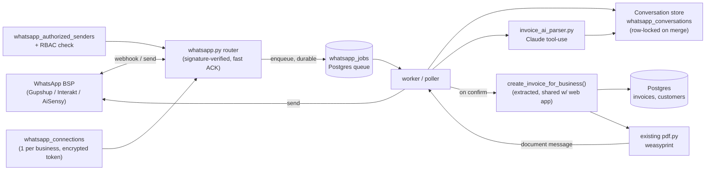

# WhatsApp Invoice Drafting — Design Spec

**Status:** Revised after adversarial review — ready for implementation planning
**Date:** 2026-08-17
**Scope:** Owner-only command flow, v1

## Summary

Business owners connect their WhatsApp number to the CRM and create invoices by
texting free-form details ("Invoice ABC Corp, 10 Widget @500, 18% GST") to it.
Claude parses the message into an invoice draft, asks targeted follow-up
questions for anything missing or ambiguous, and requires an explicit confirm
(WhatsApp buttons) before writing anything to the database. On confirm, the
flow calls the same invoice-creation logic the web app uses, then sends the
generated PDF back into the WhatsApp thread.

## Recommendation

Connect through a hosted, India-focused WhatsApp BSP (Gupshup, Interakt, or
AiSensy) rather than registering this CRM as a Meta Tech Provider directly.
Non-technical owners still connect in minutes through the BSP's hosted
onboarding; the BSP carries Meta Business verification, WABA policy
compliance, and per-number rate-limit ramp-up. This keeps the CRM focused on
invoicing rather than taking on permanent messaging-platform operational
risk (a policy violation on any connected number can affect the whole Tech
Provider app). Wrap the BSP behind a thin `whatsapp_client` adapter interface
(`send_text`, `send_buttons`, `send_document`, `verify_signature`) so a future
migration to direct Meta Cloud API — if volume or margins ever justify owning
that relationship — doesn't touch business logic.

**Open:** which specific BSP (Gupshup / Interakt / AiSensy) — needs a quick
comparison on India pricing, template-approval turnaround, and API ergonomics
before the adapter is built against one of them.

### Approaches considered

| Approach | Verdict |
|---|---|
| **C — Hybrid extract + slot-fill** (recommended) | Claude extracts everything it can from one message; only missing/ambiguous fields trigger a follow-up question. Natural for one-line dictation, falls back to structured questions when incomplete. |
| A — Single-shot parse only | Message must contain a complete invoice or is rejected. Simple, but forces one long structured message. |
| B — Fully scripted flow | Bot always asks a fixed sequence, no AI extraction. Predictable, but slow and defeats "just text it in." |

## Prerequisite refactor

`POST /invoices` (`backend/app/routers/invoices.py:110-131`) is a route
handler with FastAPI-injected `db`/`business`, not a standalone function.
Before building the WhatsApp flow, extract:

```python
def create_invoice_for_business(db: Session, business: Business, body: InvoiceCreate) -> Invoice:
    ...
```

so both the HTTP route and the WhatsApp worker call the same function. Small,
low-risk, independently testable — ship as its own PR first.

## Architecture

The webhook does the minimum needed to ACK fast and durably: verify sender
authenticity, check sender authorization, enqueue a job, return 200. A worker
does everything slow — parsing, conversation merge, invoice creation, PDF
generation, send-back — so a crash or deploy mid-request can never silently
drop a draft.

The worker runs as its own process (e.g. `python -m app.workers.whatsapp_worker`),
separate from the FastAPI app, supervised the same way as any other
long-running process in deployment. It can be scaled to multiple instances;
job claiming uses `SELECT ... FOR UPDATE SKIP LOCKED` against `whatsapp_jobs`
so two workers can never pick up the same job. This isn't optional hardening —
without it, autoscaling or a rollout overlap double-processes a job, which
compounds directly into duplicate invoice creation (see confirm idempotency
below).



## Data model

No changes to `Invoice`, `InvoiceLineItem`, or `Customer` — the flow produces
the same `InvoiceCreate` payload the web form does. Five new tables:

| Table | Purpose | Key fields |
|---|---|---|
| `whatsapp_connections` | One connected WhatsApp number per business. Every webhook lookup filters on `status = 'active'` — never resolves a business from a disconnected/revoked connection, in case a BSP ever recycles a `phone_number_id` to a different tenant. | `business_id` (unique), `phone_number_id`, `waba_id`, `access_token_encrypted`, `status` |
| `whatsapp_authorized_senders` | Which real CRM users may issue commands, and from which phone. Enrollment requires the same permission as invoice creation (or higher) and is written to the audit trail — not self-service by any logged-in user, otherwise a low-privilege user could add their own number and gain invoice-create power regardless of their RBAC role. | `business_id`, `phone_e164`, `user_id` |
| `whatsapp_conversations` | In-progress draft state per sender; expires after inactivity. Every read-modify-write against a conversation row — slot-fill merges, and the confirm→create transition — takes `SELECT ... FOR UPDATE` on that row, same mechanism as job claiming below, so two in-flight updates (second device, double-tap) serialize instead of racing. | `business_id`, `sender_phone_e164`, `state`, `draft_payload` (jsonb), `invoice_id` (nullable), `expires_at` |
| `whatsapp_message_log` | Inbound message id dedup + audit trail — the trace support walks when an owner disputes what the AI parsed. | `wa_message_id` (unique), `direction`, `conversation_id`, `created_at` |
| `whatsapp_jobs` | Durable queue between the webhook (fast ACK) and the worker (slow work). `type` includes `inbound_message` and `outbound_send` — the PDF/confirmation send-back is its own retryable job, decoupled from invoice creation, so a WhatsApp delivery failure after the invoice is already committed doesn't strand the owner with no notification. Claimed via `SELECT ... FOR UPDATE SKIP LOCKED`. | `type`, `payload` (jsonb), `status`, `attempts`, `created_at`, `processed_at` |

## Message flow

```mermaid
sequenceDiagram
    participant Owner as Owner (WhatsApp)
    participant WA as WhatsApp BSP
    participant BE as whatsapp.py webhook
    participant Q as whatsapp_jobs
    participant W as worker
    participant AI as invoice_ai_parser (Claude)
    participant SVC as create_invoice_for_business()

    Owner->>WA: "Invoice ABC Corp, 10 Widget @500, 18% GST"
    WA->>BE: POST /whatsapp/webhook (signed)
    BE->>BE: verify signature + sender allowlist
    BE->>Q: enqueue job, return 200 (fast ACK, durable)
    Q->>W: worker picks up job
    W->>AI: extract draft from message + conversation state
    AI-->>W: {customer match, line_items, gaps: []}
    W->>W: lock conversation row, merge draft
    W->>WA: interactive confirm — "ABC Corp (GSTIN ...1234) — ₹5,900 incl. GST — Confirm / Edit"
    Owner->>WA: taps Confirm
    WA->>BE: POST /whatsapp/webhook (button reply) → enqueued same path
    W->>W: SELECT ... FOR UPDATE conversation; if state == 'confirmed', no-op and re-send last result
    W->>W: set state = 'confirmed' (commit before calling SVC)
    W->>SVC: create_invoice_for_business(draft) — same function web app uses
    SVC-->>W: Invoice INV-0042, PDF bytes
    W->>Q: set conversation.invoice_id = INV-0042; enqueue outbound_send job
    W->>WA: send text + PDF document
    WA->>Owner: "Invoice INV-0042 created" + PDF
```

If a required field is missing (e.g. no GST rate given), the parse step
returns a gap and the worker asks one targeted question instead of showing
the confirm — the same conversation record accumulates answers until nothing
is missing. If the worker crashes mid-job, the row in `whatsapp_jobs` stays
pending and is retried, not lost.

**Confirm is idempotent by construction.** Two rapid taps of Confirm are two
distinct WhatsApp messages (distinct `wa_message_id`s), so message-level
dedup does not catch them — the second confirm webhook enqueues its own job.
What prevents a duplicate invoice is the row lock in the step above: the
worker locks the conversation row, checks `state`, and only calls
`create_invoice_for_business()` on the transition into `'confirmed'`. A
second confirm that finds the state already `'confirmed'` is a no-op that
just re-sends the existing result. The confirm message itself always
restates the resolved customer name (and GSTIN, if the customer has one) —
not just the total — so a bad fuzzy-match on the customer is visible before
the owner commits to it, not after.

## Security & compliance

- **Webhook authenticity** — every inbound POST verified against the BSP's
  signing scheme (HMAC over the raw body, constant-time compare) before any
  processing.
- **Sender authorization** — a message only triggers invoice creation if the
  sending phone number is in `whatsapp_authorized_senders` for that business
  *and* the linked user currently holds invoice-create permission, re-checked
  live against RBAC — not cached.
- **Sender enrollment is itself access-controlled** — adding a phone number
  to `whatsapp_authorized_senders` requires the same permission as invoice
  creation (or higher, e.g. "manage integrations") and is audit-logged. This
  is not a self-service action available to any logged-in user — otherwise
  enrollment becomes the actual privilege-escalation path onto invoice
  creation, independent of whatever RBAC role the user holds.
- **Connection resolution checks `status = 'active'`** — the webhook handler
  never resolves a business from a `whatsapp_connections` row that isn't
  active, so a disconnected/revoked connection can't route messages to the
  wrong tenant if a BSP ever reassigns a `phone_number_id`.
- **Token storage** — the BSP API key / long-lived token is encrypted at
  rest using the project's existing secrets-encryption mechanism (see
  implementation plan for the specific key-management path — env-held master
  key vs. KMS), never logged.
- **Idempotency** — webhooks can be redelivered; every `wa_message_id` is
  inserted with a unique constraint and deduped before processing (same
  insert-or-skip pattern as the invoice_no race fix). Message-level dedup
  does **not** cover a genuine second Confirm tap (a distinct message) — see
  "Confirm is idempotent by construction" above for how that's handled.
- **Draft expiry** — an unconfirmed conversation auto-expires after 30
  minutes so a stale "Confirm" tap can't resurrect an old, possibly wrong,
  draft.
- **Concurrent updates** — every read-modify-write against a conversation row
  (slot-fill merge, or the confirm→create transition) takes
  `SELECT ... FOR UPDATE` on that row, so a double-tap or a second device
  serializes instead of racing.
- **Rate limiting** — the webhook path enforces a per-business/per-sender
  rate limit, same pattern as the existing login rate-limit. This is a
  required control, not a nice-to-have: an authorized sender's number being
  spammed (SIM-swap, fat-finger, or deliberate abuse) otherwise burns Claude
  API spend and creates unbounded junk conversation rows with no technical
  ceiling.
- **LLM data exposure** — message text (customer names, amounts, and
  potentially GSTIN/PAN if the owner types them) is sent to Claude's API for
  parsing. For a GST-compliance product operating in India, this is a
  cross-border transfer of customer PII to a third-party processor and needs
  a real legal review under the DPDP Act 2023 — not just a line in the
  privacy policy. No GSTIN/PAN redaction in v1 — flagged as v2 hardening,
  contingent on that review.
- **24-hour session window** — every bot reply happens inside WhatsApp's
  session window since it only ever responds to an inbound message. Only
  matters if v2 adds proactive nudges ("you have a pending draft"), which
  would need a pre-approved template message. No action needed for v1.

## Error handling

| Situation | Behavior |
|---|---|
| Customer name doesn't match any record | Bot asks to confirm creating a new customer, or pick from close matches. |
| Required field missing (qty, price, GST rate) | One targeted follow-up question per gap. |
| Claude API timeout / error | Bot replies asking to retry or fall back to the web app — never silently drops the message. |
| Unrecognized reply to a confirm prompt | Re-sends the confirm buttons rather than guessing intent. |
| Invalid webhook signature | 403, no processing, logged as a security event. |
| Sender not in authorized list | Polite "this number isn't linked to an account" reply; logged, not processed further. |
| invoice_no race on concurrent confirms | Same unique-constraint + retry-on-409 pattern already used by the web endpoint. |
| Second Confirm tap on an already-confirmed draft | Row-locked state check finds `state == 'confirmed'`, no-ops, re-sends the existing result instead of creating a second invoice. |
| WhatsApp send fails after the invoice is already created | Invoice remains committed (it's the source of truth); the send is a separate retryable `outbound_send` job in `whatsapp_jobs`, retried independently — never silently drops the owner's notification. |
| Worker crashes mid-job | Job stays `pending`/`processing` in `whatsapp_jobs`; retried with backoff. After N attempts, moves to a dead-letter status and alerts — never silently disappears. |
| Two workers claim the same job (autoscaling/rollout overlap) | Prevented structurally — `SELECT ... FOR UPDATE SKIP LOCKED` means only one worker ever holds a given job row. |

## Testing

- Parser unit tests against fixture messages — complete, incomplete,
  ambiguous customer — with the Claude call mocked.
- Webhook signature verification — valid, invalid, replayed `wa_message_id`.
- Conversation state machine — multi-turn slot-filling, expiry after
  inactivity, concurrent-merge lock behavior.
- **Double-confirm idempotency** — two confirm webhooks for the same
  conversation (simulating a double-tap) must produce exactly one invoice.
- **Job-claim concurrency** — two worker instances polling concurrently must
  never process the same `whatsapp_jobs` row twice.
- **Outbound send failure** — invoice creation succeeds, mocked WhatsApp send
  fails; the `outbound_send` job is retried and eventually delivered, without
  creating a second invoice.
- End-to-end: simulated webhook payload → confirm → invoice row created →
  mocked WhatsApp send receives the PDF.
- Security: unauthorized sender rejected, RBAC permission revoked mid-
  conversation blocks confirm, sender enrollment blocked without the
  required permission, webhook rejects a `phone_number_id` mapped to a
  non-active connection.

## Phased scope

**v1 (this spec):** extract `create_invoice_for_business()` (prerequisite
refactor) · BSP-hosted connect · Postgres-backed durable job queue ·
free-text + slot-fill parsing · button confirm · PDF sent back on WhatsApp ·
owner-only, RBAC-linked senders.

**Deferred:** migrate to direct Meta Cloud API if volume/margins justify
owning the relationship · customer-facing bot · "same as last invoice"
history matching · multiple numbers per business · sensitive-number
redaction before the LLM call · move the job queue to Celery/Redis if
throughput outgrows a Postgres-polled table.

## Open questions

- Which BSP — Gupshup, Interakt, or AiSensy?
- DPDP Act legal review on sending customer PII to Claude's API — needs
  sign-off before launch, not just a privacy-policy line (see Security &
  compliance).
- Should there be a per-business *monthly* cap on AI-parsed messages, on top
  of the required per-sender rate limit, to bound worst-case Claude API
  spend?
