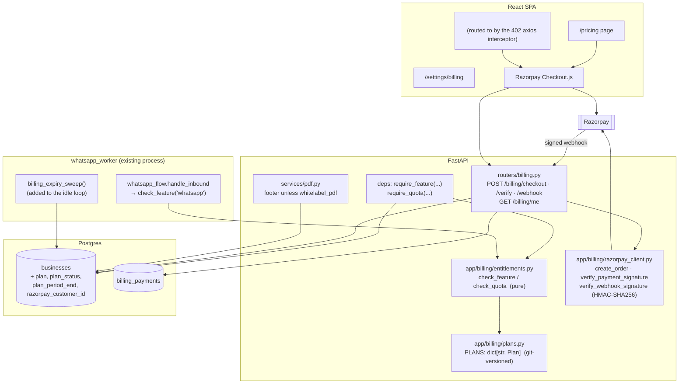

# Billing Buddy CRM — Subscription Module Design

Date: 2026-09-10
Status: Approved (design)
Branch: `subscription-module` (off `whatsapp-feature`)

## Purpose

Introduce paid plans. Manual GST invoicing stays free forever; the automation
"superpowers" (WhatsApp invoice drafting, automated inventory / supplier-invoice
ingestion, purchase & stock tracking) become **Pro**. A tenant on the Free plan
runs into soft caps on invoice volume, customers, and bank accounts, and sees a
"Powered by Billing Buddy" line on its invoice PDFs.

Money is collected through Razorpay as a **one-time annual payment** (₹4,990/yr).
Auto-renewing subscriptions, monthly billing, dunning, and conversion-rate
optimisation of the paywall are explicitly **out of scope** — a later spec.

### Non-goals (v1)

- Auto-debit / recurring mandates (Razorpay Subscriptions API) — Phase 3
- Monthly billing SKU — Phase 3
- Failed-payment dunning / retry emails — Phase 3
- Per-user seats / RBAC-gated tiers — blocked on RBAC returning
- Usage-metered billing, overage charges
- In-app upgrade nudges, dashboard usage meters, referral credits — CRO spec
- An admin web UI for plans or grants (a CLI script covers it)

## Business model

| | **Free** | **Pro** | **Business** |
|---|---|---|---|
| Price | ₹0 forever | **₹4,990 / year** (one-time, ≈ ₹416/mo) | "Talk to us" — manual grant |
| Manual GST invoicing (create/edit/finalize/PDF) | ✅ unobstructed | ✅ | ✅ |
| Finalized invoices / month | 20 | unlimited | unlimited |
| Customers | 25 | unlimited | unlimited |
| Bank accounts | 1 | 5 | unlimited |
| Users | 1 | 1 | multi (when RBAC lands) |
| WhatsApp invoice drafting | — | ✅ | ✅ |
| Automated inventory via WhatsApp / supplier-invoice ingestion | — | ✅ | ✅ |
| Purchase & stock tracking UI | — | ✅ | ✅ |
| "Powered by Billing Buddy" on invoice PDF | shown | hidden | hidden |
| Support | email | priority email | dedicated onboarding |
| API access, GSTR bulk export | — | — | ✅ |

- **Value metric:** flat per-business. Not per-seat (no multi-user), not
  per-usage (bill anxiety, unpredictable revenue).
- **Free tier is "forever-usable for a micro-business."** A one-person shop
  doing ≤ 20 invoices/month can run on Free indefinitely. This is deliberate —
  word-of-mouth in a price-sensitive market (Vyapar / myBillBook / GoGSTBill
  sit at ₹1–4k/**year**) depends on a genuinely usable free tier.
- **No trial.** Signup lands on Free. Paid features are visible but gated behind
  an upgrade interstitial.
- **Business tier** exists only as a pricing-page anchor + a CLI grant. Its
  differentiators (multi-user, API, GSTR export) are not built in v1.

### Growth hooks folded in (near-zero cost)

- The "Powered by Billing Buddy" PDF footer is a referral link:
  `https://billingbuddy.in/?ref=<business_slug>`. Every free invoice a business
  sends its customers becomes an attributable acquisition channel
  (marketing-ideas #87 "Powered-By").
- The grant CLI doubles as the mechanism for early-bird / design-partner deals
  (marketing-ideas #81).
- The WhatsApp automation is itself the viral loop — invoices go out from the
  business's own WhatsApp number. No build needed; the requirement is only that
  the core invoicing flow stays ungated.

## Architecture

Chosen approach: **config-as-code plans + plan state as columns on `businesses`
+ a shared pure `entitlements` function called from both a FastAPI dependency
and the WhatsApp worker + Razorpay one-time Orders.**

Rejected: a fully DB-driven plan/feature model with admin CRUD (YAGNI for a
3-tier model that changes ~yearly); a third-party entitlements SaaS (new vendor,
cost, DPDP data-residency questions); Razorpay Subscriptions/mandates for v1
(large lifecycle surface, and Indian SMBs distrust auto-debit).



### Why entitlement checks are effectively free

`get_current_business` already loads the `Business` row for every authenticated
request. Plan state lives on that row (`plan`, `plan_status`, `plan_period_end`),
so `check_feature(business, "whatsapp")` is a dict lookup against
`PLANS[business.plan].features` — **zero extra queries**. Only `check_quota`
issues a query, and only for the three Free-tier counters, and only on the
write endpoints that create the counted rows.

## Data model

### Migration `0009_billing.py` (additive; migrate-then-deploy safe)

Add to `businesses`:

| column | type | default | notes |
|---|---|---|---|
| `plan` | `String(16)` | `'free'` | `free` \| `pro` \| `business` |
| `plan_status` | `String(16)` | `'none'` | `none` \| `active` \| `past_due` (`past_due` reserved for Phase 3) |
| `plan_period_end` | `DateTime` (naive UTC) | `NULL` | when a paid plan reverts to Free; `NULL` on Free |
| `razorpay_customer_id` | `String(64)` | `NULL` | reserved; not required for one-time Orders |

Backfill: `UPDATE businesses SET plan='free', plan_status='none'` for every
existing row (all current tenants are internal/QA).

New table `billing_payments`:

| column | type | notes |
|---|---|---|
| `id` | uuid pk | |
| `business_id` | uuid fk → businesses.id, indexed | |
| `plan` | `String(16)` | plan this payment buys (`pro`) |
| `amount_inr` | `Numeric(10,2)` | gross paid |
| `status` | `String(16)` | `created` \| `paid` \| `failed` |
| `razorpay_order_id` | `String(64)`, indexed | set at checkout |
| `razorpay_payment_id` | `String(64)`, nullable | set at verify / webhook |
| `razorpay_event_id` | `String(64)`, **unique**, nullable | webhook dedup key (`x-razorpay-event-id`) |
| `period_start` | `DateTime` | |
| `period_end` | `DateTime` | `period_start + 1 year` |
| `created_at` | `DateTime` default `utcnow` | |

Down-migration drops the table and the four columns.

### `app/billing/plans.py`

```python
@dataclass(frozen=True)
class Plan:
    code: str
    name: str
    features: frozenset[str]        # e.g. {"whatsapp", "inventory_automation", "whitelabel_pdf"}
    quotas: dict[str, int]          # {"invoices_per_month": 20, "customers": 25, "bank_accounts": 1}
    price_inr_year: int | None      # None => not self-serve (free / business)

PLANS: dict[str, Plan] = { "free": ..., "pro": ..., "business": ... }
FREE = PLANS["free"]

# Unknown / missing plan code falls back to FREE (defensive).
def plan_for(business) -> Plan: ...
```

Feature keys (v1): `whatsapp`, `inventory_automation`, `whitelabel_pdf`.
`pro` and `business` hold all three; `free` holds none. Quota keys are only
meaningful for `free` (paid plans omit them → unlimited).

### `app/billing/entitlements.py`

```python
class QuotaState(NamedTuple):
    allowed: bool
    used: int
    limit: int | None      # None => unlimited

def check_feature(business, feature: str) -> bool

def check_quota(db, business, quota: str) -> QuotaState
    # invoices_per_month: count(Invoice) where business_id, status != 'draft',
    #                     finalized_at >= start-of-current-month (UTC)
    # customers:          count(Customer) where business_id
    # bank_accounts:      count(BankAccount) where business_id

class UpgradeRequired(Exception):
    def __init__(self, feature: str, plan_needed: str = "pro"): ...
```

`plan_period_end` is **not** consulted here — the expiry sweep is what flips
`plan` back to `free`. Between a lapse and the next sweep (≤ 5 min) a tenant
keeps Pro; acceptable.

## Enforcement

### FastAPI dependencies (`app/deps.py`)

```python
def require_feature(feature: str):
    def _dep(business: Business = Depends(get_current_business)):
        if not check_feature(business, feature):
            raise upgrade_required_http(feature)   # 402
        return business
    return _dep

def require_quota(quota: str):
    def _dep(business: Business = Depends(get_current_business),
             db: Session = Depends(get_db)):
        st = check_quota(db, business, quota)
        if not st.allowed:
            raise upgrade_required_http(quota_to_feature_hint(quota))  # 402
        return business
    return _dep
```

`upgrade_required_http` → `HTTPException(status_code=402, detail={...})` with body:

```json
{
  "detail": "Your plan doesn't include this.",
  "code": "upgrade_required",
  "feature": "whatsapp",
  "plan_needed": "pro",
  "upgrade_url": "/pricing"
}
```

(402 chosen over 403 to be unambiguously a billing signal; the `code` field is
what the client actually branches on.)

### The six gates

| # | Gate | Location | Rule |
|---|---|---|---|
| 1 | Finalize invoice | `POST /invoices/{id}/finalize` — swap `get_current_business` → `require_quota("invoices_per_month")` | Free: 20 finalized/calendar-month (UTC). Drafts unlimited. |
| 2 | Add customer | `POST /customers` → `require_quota("customers")` | Free: 25 total |
| 3 | Add bank account | `POST /bank-accounts` → `require_quota("bank_accounts")` | Free: 1 |
| 4 | WhatsApp inbound processing | `whatsapp_flow.handle_inbound` (worker) — after `business` is loaded, `if not check_feature(business, "whatsapp")` | Return a single upgrade text, **rate-limited to 1 per sender per 24h** (reuse `rate_limit` with bucket `wa:upgrade:<sender>`), then stop. Unknown senders stay silent as today. |
| 5 | Connect WhatsApp / enroll sender | Phase-C connection + sender endpoints → `require_feature("whatsapp")` | 402. **This is the single enforcement point for the `billing-buddy-agent` seam** (see below). |
| 6 | Purchasing / inventory UI | purchasing router (all routes) → `require_feature("inventory_automation")` | 402 |

Plus the PDF footer: `render_invoice_pdf` checks
`check_feature(business, "whitelabel_pdf")` — if absent, render the
"Powered by Billing Buddy" line with the `?ref=<slug>` link.

### The `billing-buddy-agent` cross-repo seam

`billing-buddy-agent` writes supplier invoices / inventory directly to the
shared Postgres tables — CRM cannot gate it at an API boundary. Resolution
**without any agent code change**:

- The agent only ingests for a business that has an **active
  `whatsapp_connections` row** (its existing behaviour).
- Creating that row (gate #5) requires Pro.
- On downgrade, the billing expiry sweep sets the connection to
  `status='disconnected'`, so the agent stops seeing the business on its next
  poll.

Contract to record in `billing-buddy-agent`'s `docs/handoff/`: *"ingest only for
businesses with `whatsapp_connections.status='active'`; treat disconnection as
'stop ingesting'."* If the agent ever ingests through another entry point, this
seam must be revisited.

## Razorpay flow (one-time annual)

Config additions (`app/config.py`, all required when `billing_enabled` is true):

```
billing_enabled: bool = False
razorpay_key_id: str = ""
razorpay_key_secret: str = ""
razorpay_webhook_secret: str = ""
```

`app/billing/razorpay_client.py` — thin adapter over Razorpay's REST API
(`https://api.razorpay.com/v1`), HTTP Basic auth with key id / secret. No SDK
dependency required (one `httpx`/`requests` call for order creation; HMAC for
verification). Mirrors `app/services/whatsapp_client.py`'s
`verify_webhook_signature` style (HMAC-SHA256 over the **raw** request body).

### Endpoints (`app/routers/billing.py`)

| Endpoint | Auth | Behaviour |
|---|---|---|
| `GET /billing/me` | session | `{plan, plan_status, plan_period_end, usage: {invoices_per_month, customers, bank_accounts: {used, limit}}, payments: [...]}` |
| `POST /billing/checkout` | session | Body `{plan:"pro"}`. 409 if already `pro`/`business` and `plan_period_end` > 60 days out. Else: create Razorpay Order for ₹4,990, insert `billing_payments(status='created', razorpay_order_id=...)`, return `{order_id, amount, currency:"INR", key_id}`. |
| `POST /billing/verify` | session | Body `{razorpay_order_id, razorpay_payment_id, razorpay_signature}`. Verify HMAC (`order_id\|payment_id` keyed by secret). On success → `_activate_pro(business, payment)`. Idempotent. |
| `POST /billing/webhook` | **public**, signature-checked | Verify `X-Razorpay-Signature` over raw body. Dedup on `x-razorpay-event-id` (unique column; duplicate → 200 no-op). Handle `payment.captured` (and `order.paid`) → look up `billing_payments` by `razorpay_order_id` → `_activate_pro(...)`. Handle `payment.failed` → mark payment `failed`. Always 200 unless signature bad (400). |

### `_activate_pro(business, payment)` — the convergence point

Idempotent. Called by both `/verify` and the webhook.

```
if payment.status == 'paid': return          # already done
payment.status = 'paid'
payment.razorpay_payment_id = ...
payment.period_start = now
payment.period_end   = now + 1 year
business.plan = 'pro'
business.plan_status = 'active'
business.plan_period_end = max(business.plan_period_end or now, payment.period_end)
commit
```

Ordering races (`/verify` before webhook, or webhook first, or webhook
duplicated) all converge to the same state because the first writer flips
`payment.status` to `paid` and the rest early-return.

Abandoned checkout: `billing_payments` row stays `created` forever (harmless;
tiny). Optional later cleanup, not v1.

### Billing expiry sweep

Add `billing_expiry_sweep(db)` to `app/services/` and call it from
`whatsapp_worker.main`'s existing idle-interval block (next to
`retention_sweep`, same ~5-min cadence — no new scheduler/process):

```
for business where plan != 'free' and plan_period_end < now():
    business.plan = 'free'
    business.plan_status = 'none'
    business.plan_period_end = NULL
    set that business's whatsapp_connections.status = 'disconnected'
commit
```

## Frontend

Axios interceptor (`src/api/client.ts`): on `402` with
`data.code === "upgrade_required"`, stash `{feature, plan_needed}` in a small
zustand store and navigate to `<UpgradeInterstitial>` (or open it as a modal
over the current route). Non-402 handling unchanged.

New files:

- `src/pages/PricingPage.tsx` (`/pricing`) — three columns (Free / Pro / Business).
  Pro CTA → `startCheckout()`. Business CTA → `mailto:` / contact link.
- `src/pages/BillingSettingsPage.tsx` (`/settings/billing`) — current plan,
  `plan_period_end` ("Pro until 10 Sep 2027"), three usage lines
  ("14 / 20 invoices this month"), Upgrade button, payment-receipt list from
  `GET /billing/me`.
- `src/components/UpgradeInterstitial.tsx` — names the locked feature, one CTA
  to `/pricing` (or straight to checkout).
- `src/api/billing.ts` — `getBilling()`, `startCheckout()`, `verifyCheckout()`.
- `startCheckout()` loads Razorpay Checkout.js (`checkout.razorpay.com`), opens
  it with the `order_id` from `POST /billing/checkout`, and in its handler calls
  `POST /billing/verify`, then refetches `GET /billing/me` and shows success.

`AppShell` nav gains a "Billing" link under settings. WhatsApp settings and
Purchasing nav entries render behind a `<PaywallGate feature="...">` that shows
a lock + "Upgrade" rather than hiding them (discovery — onboarding-cro: paywall
*after* the aha moment, never a dead end).

## Rollout

- **Phase 1 — entitlements core.** Migration 0009 (4 columns + the
  `billing_payments` table — the table ships now even though nothing writes it
  until Phase 2 / the grant CLI), `plans.py`, `entitlements.py`,
  `require_feature`/`require_quota`, wire gates 1–4 and 6 + PDF footer, grant CLI,
  `GET /billing/me`, read-only `BillingSettingsPage`. `billing_enabled=false`
  everywhere — gates enforce, **no pay button, no `/pricing` in nav**. Deploy
  dark. Every tenant is Free; Pro is granted only by CLI.
- **Phase 2 — Razorpay checkout.** No new migration (0008 already created
  `billing_payments`). `razorpay_client.py`,
  `routers/billing.py` (`/checkout`, `/verify`, `/webhook`), expiry sweep,
  `PricingPage`, `UpgradeInterstitial`, Checkout.js glue, gate #5 wired when
  Phase C of the WhatsApp feature lands. Flip `billing_enabled=true`.
- **Phase 3 — later, separate spec.** Razorpay Subscriptions (auto-renew),
  monthly SKU, dunning + reminder emails, CRO polish (in-app nudges, dashboard
  usage meters), referral credits, Business-tier features (RBAC multi-user, API,
  GSTR export).

### Grant CLI

`python -m app.billing.grant <business-email> <plan> [--months N]` — looks up
the business via its user's email, sets `plan`, `plan_status='active'`,
`plan_period_end = now + N months` (default 12), inserts a `billing_payments`
row with `status='paid'`, `amount_inr=0`, `razorpay_order_id='manual-grant'`
for the audit trail. `--revoke` sets the business back to Free.

## Testing

- **Entitlement matrix:** for each plan × each feature/quota — `check_feature`
  and `check_quota` return the expected verdict; boundary at exactly the limit
  (20th invoice allowed, 21st 402).
- **Gate integration:** each of the six endpoints returns 402 with the correct
  body shape for a Free business at/over limit; 200 for Pro.
- **Invoice quota is calendar-month scoped:** finalizing in a new month resets
  the count; drafts never count.
- **Razorpay webhook:** bad signature → 400; valid → activates; **replayed
  `x-razorpay-event-id` → 200 no-op, no double-activation**; `payment.failed`
  → payment row `failed`, plan unchanged.
- **Convergence:** `/verify` then webhook, webhook then `/verify`, webhook twice
  — all leave exactly one `paid` payment and `plan='pro'`.
- **Expiry sweep:** `plan_period_end` in the past → reverts to Free and
  disconnects the WhatsApp connection; future date → untouched.
- **WhatsApp worker gate:** Free business, authorized sender → exactly one
  upgrade text, second message within 24h → silent; Pro business → normal flow.
- **Grant CLI:** grants, revokes, writes the audit payment row.
- **Migration 0009:** down → up round-trip; backfill sets every existing
  business to Free.
- **`billing_enabled=false`:** `/billing/checkout` → 404/503; gates still enforce.

Target: existing 265 backend tests stay green; new suite
`tests/test_billing.py` + `tests/test_entitlements.py`.

## Deploy / ops notes

- Migration 0009 is additive (new nullable columns with defaults + new table) →
  **migrate before deploying** the new app code, no backward-compat window.
- New required env when `billing_enabled=true`: `RAZORPAY_KEY_ID`,
  `RAZORPAY_KEY_SECRET`, `RAZORPAY_WEBHOOK_SECRET`. Add to the deploy runbook
  and `docker-compose` env. `BILLING_ENABLED` defaults false.
- Register the Razorpay webhook URL (`/billing/webhook`) for `payment.captured`,
  `order.paid`, `payment.failed`; store the signing secret.
- DPDP: Razorpay is India-based, data stays in India. CRM stores only Razorpay
  IDs and amounts — never card / UPI details.
- The billing expiry sweep runs inside the existing `whatsapp_worker` process —
  that process must be running for downgrades to take effect. Document the
  dependency; a lapsed tenant keeps Pro until the worker sweeps (≤ 5 min, or
  until the worker is next up).

## Open items (non-blocking)

- Razorpay Route / settlement reconciliation, GST invoice from Razorpay to the
  customer for the ₹4,990 — Razorpay can auto-generate; confirm during Phase 2.
- `business_slug` for the `?ref=` link doesn't exist yet — derive from
  `business.id` short form or add a slug column in Phase 1's migration.
- Whether to prorate / credit when a Free tenant that's over the new caps first
  sees enforcement — v1: existing over-limit tenants are **not** retroactively
  blocked from what they have; they just can't add more until under the cap or
  upgraded. (Free-tier counts are "create" gates, not "delete your data" gates.)
```
